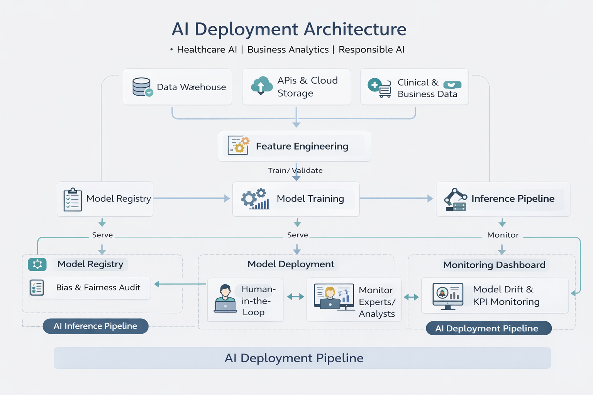

# AI & Advanced Analytics Portfolio
**Healthcare AI | Business Analytics | Responsible AI Consulting**

---

## Professional Focus

This portfolio presents applied machine learning, healthcare AI, and business analytics projects designed for real-world operational deployment. The work emphasizes:

- Transparency and interpretability  

- Regulatory and ethical awareness

- Practical deployment considerations

- Measurable business or clinical impact  

The focus is not purely academic model performance, but responsible AI that can function in production environments.

## Dual Specialization
### Healthcare Artificial Intelligence
- Clinical risk modeling
- Medical imaging AI
- Healthcare operational analytics
- Explainable AI for clinical decision support

*These projects prioritize safety, interpretability, and realistic clinical adoption pathways.*  

### Business & Commercial Analytics
- Customer intelligence and segmentation
- Revenue and demand forecasting
- Fraud risk scoring systems
- Marketing performance optimization
- Decision-support analytics

> **The goal is responsible, production-ready AI that improves outcomes while maintaining trust, compliance, and operational practicality.**

---

## Responsible AI Principles

Across all projects, the following principles guide development:

### Transparency & Explainability
- Model interpretability integrated where possible (e.g., SHAP, saliency methods)
- Results presented in decision-support context rather than black-box predictions

### Risk-Aware Deployment
- Conservative claims about model performance
- Explicit documentation of dataset limitations
- Emphasis on human oversight in high-stakes applications

### Governance & Compliance Awareness
- Consideration of healthcare regulatory pathways (e.g., clinical validation, SaMD considerations)
- Attention to data privacy, fairness, and auditability

### Deployment-Oriented Approach

Projects are structured beyond modeling to reflect real operational environments:
- Data ingestion pipelines
- Model validation and monitoring concepts
- Deployment constraints and operational workflows
- Stakeholder usability considerations
- Decision-impact interpretation

*This reflects how AI is actually adopted in clinical, financial, and enterprise settings.*

### Deployment Architecture Overview

---

## Responsible & Ethical AI Commitment

Responsible AI principles guide all projects within this portfolio, particularly in healthcare, financial risk analytics, and decision-support applications where model outputs can affect real-world outcomes.

### Bias Assessment & Fairness

Where datasets permit, bias risk is evaluated through:

- Class imbalance analysis
- Subgroup performance comparison
- Feature sensitivity review
- Documentation of dataset limitations

The goal is risk awareness rather than unsupported claims of fairness.

### Transparency & Explainability

Model interpretability is prioritized whenever feasible:

- Explainability techniques (e.g., SHAP, feature attribution, saliency mapping)
- Clear documentation of model assumptions
- Decision-support framing rather than automated decision replacement

This supports clinician, analyst, and stakeholder trust.

### Data Governance Awareness

Projects emphasize responsible data handling:

- Awareness of privacy considerations
- Documentation of dataset provenance and limitations
- Auditability and reproducibility considerations

No claims are made beyond dataset scope or validation evidence.

### Human Oversight & Safe Deployment

High-stakes applications require human review:

- Human-in-the-loop workflows encouraged
- Conservative performance interpretation
- Monitoring recommendations for post-deployment safety

AI systems should augment expert decision-making, not replace it.

---

## Healthcare AI Portfolio Highlights

Representative themes include:
- Disease risk prediction models with explainability
- Medical imaging AI prototypes
- Survival analysis for hospital operational planning
- Responsible AI framing for clinical applications

**These projects emphasize clinical caution, transparency, and realistic deployment pathways.**

---

## Business Analytics Portfolio Highlights

Projects focus on measurable organizational impact and capital-efficient decision-making:
- Customer Lifetime Value (CLV) & Profit Optimization — Revenue concentration analysis, retention ROI modeling, and
  executive decision-support dashboard
- Customer segmentation for revenue optimization
- Fraud risk scoring with governance considerations
- Marketing analytics and ROI evaluation
- Sales forecasting for operational planning

**The emphasis is on decision support and measurable organizational impact.**

---

## Consulting Philosophy

The underlying approach across all work:

- **Practical** over theoretical
- **Transparent** over opaque
- **Impact-driven** over metric-driven
- **Responsible AI** over rapid experimentation

> AI systems must be trustworthy, interpretable, and aligned with real operational needs.

---

## Intended Use of This Portfolio

This portfolio supports:
- Consulting engagements
- Collaboration opportunities
- Applied research translation
- Healthcare AI initiatives
- Enterprise analytics projects

---

## Contact / Collaboration

Open to collaboration in:
- Healthcare Artificial Intelligence
- Applied machine learning
- Responsible AI consulting
- Advanced analytics strategy

---
